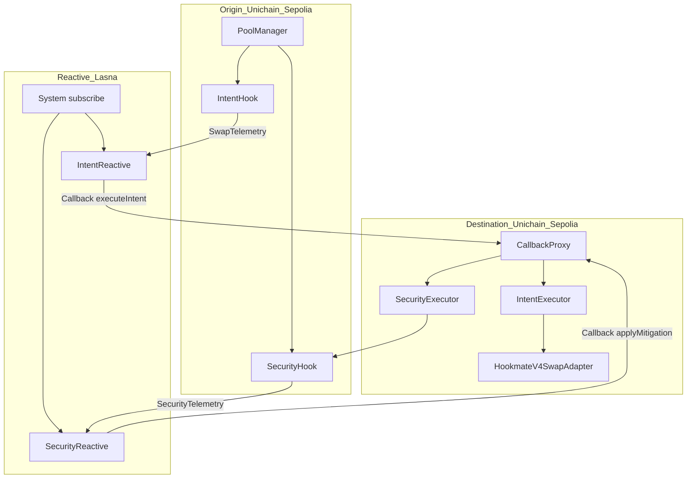
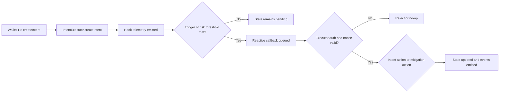
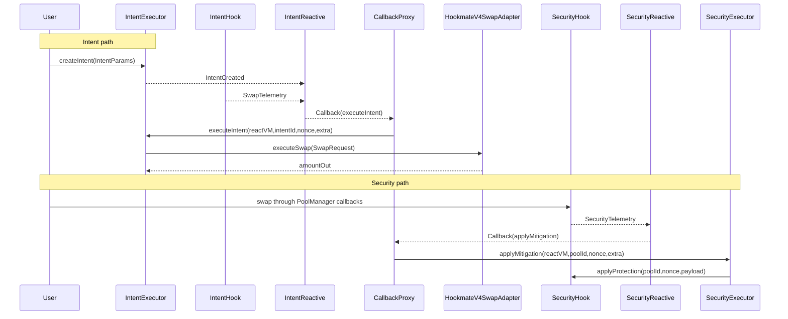
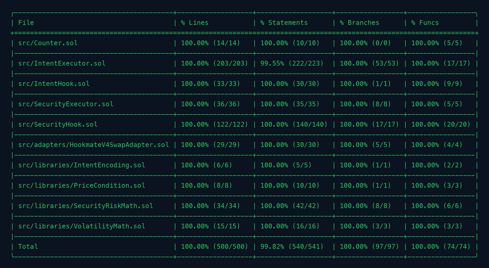

# RITE Hook
**Built on Uniswap v4 × Reactive Network · Deployed on Unichain Sepolia × Reactive Lasna**

_Targeting: Uniswap Foundation Prize · Unichain Prize · Reactive Network Prize_

> RITE Hook is an onchain intent execution and hook security system that combines deterministic triggers with Reactive callbacks to enforce execution policy and risk mitigation in real time.

     

## The Problem
A Uniswap pool can face a fast two-transaction toxic-flow sequence where a searcher pre-positions inventory, a user swap executes at a degraded effective price, and an unwind closes the position. At the protocol level, the pool executes valid swaps, but there is no native cross-domain risk process that can continuously score post-trade telemetry and deterministically enforce mitigation state on subsequent swaps. The immediate capital impact is execution loss to the taker and adverse selection borne by LP inventory.

A second failure layer appears in intent-style execution when triggering logic is distributed across bots and offchain workers. Without strict callback sender authentication, monotonic nonce handling, and deterministic stale-callback behavior, equivalent payloads can be retried, reordered, or replayed into inconsistent intent states. At EVM level, this is a state-transition safety problem: asynchronous call surfaces can drift from expected `PENDING -> EXECUTED/CANCELLED/EXPIRED` transitions if nonce and auth checks are weak.

A third failure layer is mitigation latency. Even when operators detect abnormal volatility, slippage, or liquidity imbalance, response is frequently manual, which means protection state is applied after toxic flow has already propagated. Uniswap v4 introduces hook-time control points, but without deterministic scoring and authenticated callback delivery, those control points do not become an autonomous security plane. At current DEX scale, where monthly volume is in the hundreds of billions of dollars, small basis-point inefficiencies translate into material LP and user loss.

## The Solution
The core insight is to fuse deterministic hook telemetry with authenticated Reactive callbacks so that execution and protection decisions become state-machine transitions, not operator timing decisions.

At user and operator level, the flow is direct: a user creates an intent with price/time/volatility conditions; hooks emit telemetry during swaps; Reactive contracts score those logs and queue callback payloads; destination executors accept only valid callback proxy + allowlisted ReactVM sources, then execute intent actions or mitigation actions idempotently. The guarantee is that stale or unauthorized callbacks do not mutate execution state, while valid callbacks produce bounded, auditable transitions.

At EVM level, the system uses Uniswap v4 swap hook permissions (`beforeSwap`, `afterSwap`), canonical `PoolKey -> PoolId` mapping, callback payload arg0 ReactVM replacement semantics, and strict executor-side gates. `IntentExecutor.executeIntent(address,bytes32,uint256,bytes)` and `SecurityExecutor.applyMitigation(address,bytes32,uint256,bytes)` both require callback sender authenticity and ReactVM allowlisting; both enforce nonce progression; both reject stale inputs without corrupting state. Hook-side mitigation enforcement is bounded by per-pool config caps and enforced before swap execution.

INVARIANT: Unauthorized callback sender never mutates intent or mitigation state — verified by `IntentExecutor.executeIntent(address,bytes32,uint256,bytes)` and `SecurityExecutor.applyMitigation(address,bytes32,uint256,bytes)`  
INVARIANT: Nonce progression is monotonic per intent and per pool — verified by `IntentExecutor.executeIntent(address,bytes32,uint256,bytes)` and `SecurityExecutor.applyMitigation(address,bytes32,uint256,bytes)`  
INVARIANT: Mitigation bounds cannot exceed configured per-pool limits — verified by `SecurityHook.applyProtection(bytes32,uint256,MitigationPayload)`

## Architecture

### 8a. Component Overview
```text
RITE
├── Origin (Unichain Sepolia)
│   ├── IntentHook
│   │   └── Emits swap telemetry and rolling volatility observations
│   └── SecurityHook
│       └── Emits risk telemetry and enforces dynamic fee/throttle/pause
├── Reactive (Lasna)
│   ├── IntentReactive
│   │   └── Tracks intents and queues executeIntent callbacks
│   └── SecurityReactive
│       └── Scores risk deterministically and queues applyMitigation callbacks
└── Destination (Unichain Sepolia)
    ├── IntentExecutor
    │   └── Authenticates callbacks and runs intent lifecycle transitions
    ├── SecurityExecutor
    │   └── Authenticates callbacks and dispatches mitigation payloads
    └── HookmateV4SwapAdapter
        └── Isolates swap execution and token approval surfaces
```

### 8b. Architecture Flow (Subgraphs)


### 8c. User Perspective Flow


### 8d. Interaction Sequence


## Core Contracts & Components

### IntentHook
`IntentHook` exists to keep trigger telemetry close to the swap execution boundary while minimizing state and branching in hook callbacks. It captures deterministic swap observations per pool and emits normalized events that upstream Reactive logic can consume without querying mutable external state.

Its critical callback overrides are `function _beforeSwap(address sender, PoolKey calldata key, SwapParams calldata params, bytes calldata hookData) internal override returns (bytes4, BeforeSwapDelta, uint24)` and `function _afterSwap(address sender, PoolKey calldata key, SwapParams calldata params, BalanceDelta delta, bytes calldata hookData) internal override returns (bytes4, int128)`. It also exposes owner-managed configuration via `function setVolatilityWindow(uint32 volatilityWindow_) external onlyOwner`.

The storage it owns is `uint32 public volatilityWindow` and `mapping(PoolId => PoolTelemetry) private _poolTelemetry`. The trust boundary is split: swap callbacks are PoolManager-mediated through `BaseHook` semantics, while configuration is owner-only. Unauthorized configuration attempts revert, and unauthorized direct callback invocation is blocked by hook framework enforcement. Upstream it receives pool callbacks; downstream it emits `SwapTelemetry` for `IntentReactive`.

### IntentExecutor
`IntentExecutor` is the intent state machine and settlement authority. It exists separately so callback authentication, replay protection, and token custody transitions are concentrated in one auditable module instead of being spread across hook logic and adapters.

Critical entrypoints are `function createIntent(IntentParams calldata params) external nonReentrant returns (bytes32 intentId)`, `function updateIntent(bytes32 intentId, uint256 amountOutMin, uint64 expiry, TriggerConfig calldata trigger) external nonReentrant`, `function cancelIntent(bytes32 intentId) external nonReentrant`, and `function executeIntent(address reactVM, bytes32 intentId, uint256 nonce, bytes calldata extra) external nonReentrant returns (bool)`. Admin wiring functions are `setCallbackProxy(address)`, `setReactVM(address,bool)`, and `setSwapAdapter(IIntentSwapAdapter)`.

Its storage includes `address public callbackProxy`, `IIntentSwapAdapter public swapAdapter`, `mapping(address => bool) public reactVMAllowlist`, `mapping(address => uint256) public userIntentCount`, `mapping(bytes32 => Intent) private _intents`, and `mapping(bytes32 => ExecutionResult) public lastExecution`. Trust boundary enforcement is explicit: callback-originated execution requires `msg.sender == callbackProxy` and allowlisted ReactVM; owner-only controls mutate auth and adapter configuration. Unauthorized callback senders revert with `UnauthorizedCallbackSender`, unauthorized ReactVMs revert with `UnauthorizedReactVM`, and stale nonce attempts produce deterministic no-op events instead of unsafe state writes.

### HookmateV4SwapAdapter
`HookmateV4SwapAdapter` isolates swap execution from intent lifecycle logic. This separation exists so custody-sensitive token transfers, approvals, and router interaction can be audited independently from nonce and trigger policy.

Its core external function is `function executeSwap(SwapRequest calldata request) external returns (uint256 amountOut)`, with access wiring through `function setExecutor(address executor_) external onlyOwner`. Execution is restricted to a configured executor address and uses a Uniswap v4-compatible router path with `router.swapExactTokensForTokens(...)`.

Storage includes immutable router references (`router`, `permit2`, `poolManager`), mutable `address public executor`, and `mapping(address => bool) private _tokenApprovalInitialized`. Trust boundary is strict: only the executor can call `executeSwap`, otherwise `UnauthorizedExecutor` reverts. In call-stack terms, `IntentExecutor` sits above this adapter and receives output amounts; Uniswap router and Permit2 sit below it.

### SecurityHook
`SecurityHook` is the enforcement point for risk mitigation at swap time. It is separated from the risk engine so scoring policy and callback ingestion can evolve without placing heavy computation inside hook callbacks.

Its critical functions are `function _beforeSwap(address, PoolKey calldata key, SwapParams calldata params, bytes calldata) internal override returns (bytes4, BeforeSwapDelta, uint24)`, `function _afterSwap(address sender, PoolKey calldata key, SwapParams calldata params, BalanceDelta delta, bytes calldata) internal override returns (bytes4, int128)`, and `function applyProtection(bytes32 poolIdRaw, uint256 nonce, MitigationPayload calldata payload) external returns (bool applied)`. Admin interfaces include `setSecurityExecutor(address)`, `setVolatilityWindow(uint32)`, and `setPoolProtectionConfig(bytes32,ProtectionConfig)`.

Owned state is `uint32 public volatilityWindow`, `address public securityExecutor`, `mapping(PoolId => PoolTelemetry) private _poolTelemetry`, `mapping(PoolId => ProtectionConfig) private _poolProtectionConfig`, and `mapping(PoolId => ProtectionState) private _poolProtectionState`. Trust boundary is dual: hook callbacks remain PoolManager-controlled; mitigation application is allowed only from `securityExecutor`, else `SecurityHook__UnauthorizedExecutor` reverts. It sits below `SecurityExecutor` in the callback stack and above PoolManager execution in swap gating.

### SecurityExecutor
`SecurityExecutor` is the destination-chain callback gate for mitigation payloads. It exists as a dedicated trust boundary so callback authenticity, ReactVM allowlisting, and nonce monotonicity checks are performed before any hook state can change.

The primary entrypoint is `function applyMitigation(address reactVM, bytes32 poolId, uint256 nonce, bytes calldata extra) external nonReentrant returns (bool)`. Configuration functions are `setCallbackProxy(address)`, `setReactVM(address,bool)`, and `setSecurityHook(ISecurityHook)`.

Storage includes `address public callbackProxy`, `ISecurityHook public securityHook`, `mapping(address => bool) public reactVMAllowlist`, and `mapping(bytes32 => uint256) public lastMitigationNonce`. Unauthorized senders and unallowlisted ReactVMs revert; stale nonce submissions emit `MitigationRejected` with reason `STALE_NONCE` and return false. Upstream it is called by callback proxy, downstream it invokes `SecurityHook.applyProtection(...)` atomically.

### IntentReactive
`IntentReactive` is the cross-domain trigger dispatcher for intent execution. It exists to convert logs into deterministic callback payloads while preserving deduplication and dispatch retry discipline.

Key functions are `function react(LogRecord calldata log) external vmOnly`, `function setCallbackGasLimit(uint64 callbackGasLimit_) external onlyOwner`, and `function setDispatchRetryInterval(uint64 dispatchRetryInterval_) external onlyOwner`. It subscribes to `IntentCreated`, `IntentCancelled`, `IntentExecuted`, and `SwapTelemetry` topics through Reactive system contract subscription interfaces in constructor execution context.

Its storage includes `mapping(bytes32 => ReactiveIntent) public trackedIntents`, `mapping(bytes32 => bytes32[]) public intentsByPool`, `mapping(bytes32 => bool) public processedLogs`, and `mapping(bytes32 => uint256) public lastDispatchedNonce`. Trust boundary is owner config + VM-only reactive execution context; duplicate log keys are ignored idempotently. It sits between hook/executor event emission on origin chain and callback dispatch toward destination `IntentExecutor`.

### SecurityReactive
`SecurityReactive` is the deterministic risk scorer and mitigation payload generator. It is a distinct module so risk model weights, thresholds, and cooldown semantics remain explicit and independently testable.

Critical functions are `function react(LogRecord calldata log) external vmOnly`, `function setRiskConfig(RiskConfig calldata config) external onlyOwner`, and `function setCallbackGasLimit(uint64 callbackGasLimit_) external onlyOwner`. Scoring logic computes weighted components (volatility, price deviation, slippage, imbalance, volume spike, temporal correlation, MEV heuristic) and emits callback payloads for `SecurityExecutor.applyMitigation(...)`.

Owned state includes `uint64 public callbackGasLimit`, `RiskConfig public riskConfig`, `mapping(bytes32 => bool) public processedLogs`, and `mapping(bytes32 => PoolRiskState) public poolRiskState`. Trust boundary is owner-controlled risk configuration plus VM-only log reaction path. It receives `SecurityTelemetry` from origin hook and emits callback events consumed by callback infrastructure on destination chain.

### Data Flow
In the primary intent use case, `IntentExecutor.createIntent(IntentParams)` computes an `intentId`, increments `userIntentCount[user]`, stores `_intents[intentId]`, transfers custody of `tokenIn`, and emits `IntentCreated`. On subsequent pool activity, `IntentHook._afterSwap(...)` updates `_poolTelemetry[poolId]` fields (`sqrtPriceX96`, `tick`, `rollingVolatilityBps`, counters, timestamp) and emits `SwapTelemetry`. `IntentReactive.react(LogRecord)` marks `processedLogs[logKey] = true`, updates `trackedIntents`/`intentsByPool` on create/cancel/execute logs, and on trigger hit emits `Callback(...)` while writing `lastDispatchedNonce[intentId]` and `lastTriggeredAt`. Callback infrastructure calls `IntentExecutor.executeIntent(...)`, which authenticates sender and ReactVM, validates status/nonce/expiry/context/trigger, then calls `HookmateV4SwapAdapter.executeSwap(...)`. The adapter enforces executor-only access, transfers input tokens, initializes approvals if required, executes router swap, and transfers output tokens back to recipient. `IntentExecutor` then updates `remainingAmount`, `nonce`, `status`, `lastExecutionAt`, `lastExecution[intentId]`, and emits `IntentExecuted` or `ExecutionFailed`.

In the security use case, `SecurityHook._afterSwap(...)` updates `_poolTelemetry[poolId]` metrics including rolling volume and anomaly components, increments sequence, and emits `SecurityTelemetry`. `SecurityReactive.react(LogRecord)` deduplicates via `processedLogs`, computes risk components from `poolRiskState`, writes `lastObservedAt`, `lastRiskScoreBps`, direction, sequence, and if thresholds pass/cooldown allows, increments mitigation nonce and emits mitigation callback payload. Callback infrastructure calls `SecurityExecutor.applyMitigation(...)`, which checks callback sender and ReactVM allowlist, enforces `nonce > lastMitigationNonce[poolId]`, decodes payload, and invokes `SecurityHook.applyProtection(...)`. Hook applies bounded protection state writes (`currentFeePips`, `throttleBps`, `maxTradeSize`, `pauseUntil`, `lastRiskScoreBps`, `nonce`, `updatedAt`) and emits `ProtectionApplied`; future swaps are gated in `_beforeSwap(...)` by pause/throttle/max size checks.

## Intent & Mitigation Regimes

| Regime | Entry Condition | Action | Exit Condition |
|---|---|---|---|
| Intent `PENDING` | `createIntent` succeeds | Await trigger and callback | `EXECUTED`, `CANCELLED`, or `EXPIRED` |
| Intent `EXECUTED` | Remaining amount reaches zero | Emit `IntentExecuted(..., fullyExecuted=true)` | Terminal |
| Intent `CANCELLED` | Owner calls `cancelIntent` | Refund remaining `tokenIn` | Terminal |
| Intent `EXPIRED` | Callback sees `block.timestamp > expiry` | Mark expired and refund | Terminal |
| Mitigation `ADAPTIVE_FEE` | `highRiskScoreBps` crossed | Apply dynamic fee override | Next mitigation nonce |
| Mitigation `COMBINED` | `criticalRiskScoreBps` crossed or MEV-sensitive high risk | Apply fee + throttle + pause | Cooldown elapsed / newer nonce |
| Mitigation `REJECTED` | Stale nonce or hook no-op | Emit `MitigationRejected` | Retry with fresh nonce |

A non-obvious behavior is that stale callbacks are deterministic no-ops instead of reverts in several paths, so replayed payloads do not corrupt state but still produce auditable rejection events. Another is that time-triggered intents can execute partial chunks via `chunkBips`, while non-time triggers default to remaining-amount execution unless `maxAmountIn` narrows the slice.

## Deployed Contracts

### Unichain Sepolia (chainId 1301)

| Contract | Address |
|---|---|
| SecurityHook | [0xba2c5f11dd1fb23aac23a2cf867b0aac66b5c0c0](https://sepolia.uniscan.xyz/address/0xba2c5f11dd1fb23aac23a2cf867b0aac66b5c0c0) |
| SecurityExecutor | [0xea6f97e8791ec5046156f396f91d781f6e52745f](https://sepolia.uniscan.xyz/address/0xea6f97e8791ec5046156f396f91d781f6e52745f) |
| IntentHook | [0xcd6f29059a63dc1fd76eb11e160c9982a5e380c0](https://sepolia.uniscan.xyz/address/0xcd6f29059a63dc1fd76eb11e160c9982a5e380c0) |
| IntentExecutor | [0xb2ad842f589110a1bf2c97570142fb938213b0fa](https://sepolia.uniscan.xyz/address/0xb2ad842f589110a1bf2c97570142fb938213b0fa) |
| HookmateV4SwapAdapter | [0x35b891053025db3581abf3dd88bc8453f22c3899](https://sepolia.uniscan.xyz/address/0x35b891053025db3581abf3dd88bc8453f22c3899) |

### Reactive Lasna (chainId 5318007)

| Contract | Address |
|---|---|
| SecurityReactive | [0xf423167e2ee956862201e7f810716545b9997609](https://lasna.reactscan.net/address/0xf423167e2ee956862201e7f810716545b9997609) |

## Live Demo Evidence
Demo run date: March 19, 2026.

### Phase 1 — Origin baseline deployment proof (Unichain Sepolia)
This phase proves that the origin and destination contracts used in the run are deployed and wired. The deployment sequence creates `SecurityHook`, `SecurityExecutor`, `IntentHook`, `HookmateV4SwapAdapter`, and `IntentExecutor`, then executes required post-deploy wiring calls (`setSecurityExecutor`, `setExecutor`). Verifiers should inspect each transaction trace for CREATE/CREATE2 operations and emitted ownership/configuration events: [0x75109e4a1f88b3c8cc81001eeb541901ec0edf816b5bd392a20e243085b9d296](https://sepolia.uniscan.xyz/tx/0x75109e4a1f88b3c8cc81001eeb541901ec0edf816b5bd392a20e243085b9d296), [0xb8b7210784c2e72d18514c9f7f07557dcd27b6032b923b062edf65f5eaee63fc](https://sepolia.uniscan.xyz/tx/0xb8b7210784c2e72d18514c9f7f07557dcd27b6032b923b062edf65f5eaee63fc), [0x6b4cb152c500604461fdcd4c64344d084bcb16b04968eb1726108027d53920c1](https://sepolia.uniscan.xyz/tx/0x6b4cb152c500604461fdcd4c64344d084bcb16b04968eb1726108027d53920c1), [0xa5eec5f699fff4bb02d15f2a43313bed283f92fa76b36e4c16c2372b0b2a619b](https://sepolia.uniscan.xyz/tx/0xa5eec5f699fff4bb02d15f2a43313bed283f92fa76b36e4c16c2372b0b2a619b), [0xd5287830e2f8b21105a4bffcde517a4d66e83df996e2b00ff007b3c16f3a2a20](https://sepolia.uniscan.xyz/tx/0xd5287830e2f8b21105a4bffcde517a4d66e83df996e2b00ff007b3c16f3a2a20), [0x9bc4c8306c433b52ee88de03359520e5eef02fa216efdc7454a3804067d80b62](https://sepolia.uniscan.xyz/tx/0x9bc4c8306c433b52ee88de03359520e5eef02fa216efdc7454a3804067d80b62), [0x2273d05ab5652ba67045ae4fbed51ba99d89fe15c88c2f6fa6778574295f7257](https://sepolia.uniscan.xyz/tx/0x2273d05ab5652ba67045ae4fbed51ba99d89fe15c88c2f6fa6778574295f7257). This phase proves the contract surface used by later demo transactions is real and chain-resident.

### Phase 2 — Reactive deployment proof (Reactive Lasna)
This phase proves Reactive callback infrastructure integration is live by showing the deployed Reactive contract transaction that is reused in the run. Verifiers should inspect creation code and constructor args for owner/chain IDs/hook/executor wiring and confirm emitted deployment metadata: [0x3e2f8adfb22f0c4c6327522fb4588521f9ffe282d12d7e4418063486c79d7850](https://lasna.reactscan.net/tx/0x3e2f8adfb22f0c4c6327522fb4588521f9ffe282d12d7e4418063486c79d7850). This phase proves the cross-network callback producer is deployed on Lasna.

### Phase 3 — Callback auth wiring proof (Unichain Sepolia)
This phase proves the destination executor callback sender can be explicitly set for controlled demo invocation. The transaction calls `IntentExecutor.setCallbackProxy(address)` and emits `CallbackProxyUpdated(address)`; verifiers should check log topic `0xfb8b143b...` and updated storage on the executor: [0x8c1e5f8662caf6632e2d5323ea12ef888a2d17e03d7cd94176d88c38ae60840e](https://sepolia.uniscan.xyz/tx/0x8c1e5f8662caf6632e2d5323ea12ef888a2d17e03d7cd94176d88c38ae60840e). This phase proves callback trust boundaries are explicit and auditable.

### Phase 4 — User intent lifecycle proof (Unichain Sepolia)
This phase proves end-to-end intent lifecycle transitions under deterministic execution constraints. Two token contracts are created for isolated demo state ([0x4fe799c2ab08bbd6c3d62ee249fd8cff690c5ff00e1386ccde890c0066000b50](https://sepolia.uniscan.xyz/tx/0x4fe799c2ab08bbd6c3d62ee249fd8cff690c5ff00e1386ccde890c0066000b50), [0xb18d3f281fe49191afe4a41baaded9af1e87dd53d54cf1438e05e68da20cc1b9](https://sepolia.uniscan.xyz/tx/0xb18d3f281fe49191afe4a41baaded9af1e87dd53d54cf1438e05e68da20cc1b9)); owner balance is minted on each token ([0xa7e736f30c8af0f4237df63fe0352e5bfa8279031f3b4d6c9a3ccd0c8801695e](https://sepolia.uniscan.xyz/tx/0xa7e736f30c8af0f4237df63fe0352e5bfa8279031f3b4d6c9a3ccd0c8801695e), [0x90d98f375cf35f7ed47ea4d77e466f4e13b9575d9f4ecbfb70a13ff92c315700](https://sepolia.uniscan.xyz/tx/0x90d98f375cf35f7ed47ea4d77e466f4e13b9575d9f4ecbfb70a13ff92c315700)); allowance is granted to executor ([0x4bf7ad00a15373f3d342444cac90b26afac8040b3a51626776df0db9f4e47ae8](https://sepolia.uniscan.xyz/tx/0x4bf7ad00a15373f3d342444cac90b26afac8040b3a51626776df0db9f4e47ae8)); `createIntent(...)` writes pending state and emits `IntentCreated` ([0x24350aeb3cf11553826c913233816f99f0981cce6c3b982dd27409bc6319ad80](https://sepolia.uniscan.xyz/tx/0x24350aeb3cf11553826c913233816f99f0981cce6c3b982dd27409bc6319ad80)); `executeIntent(...)` emits `IntentExecutable` then `ExecutionFailed` on adapter path ([0x265ef22022e0d7cbc28241329811bfa9c4c5b47d5ad0ec86b4ab76db04e91656](https://sepolia.uniscan.xyz/tx/0x265ef22022e0d7cbc28241329811bfa9c4c5b47d5ad0ec86b4ab76db04e91656)); finally `cancelIntent(bytes32)` closes lifecycle and refunds residual custody ([0x123a38baa1d9cfdc0b7860a90aacb0dd6e65bf0a832cb80c6fac0739933a1d85](https://sepolia.uniscan.xyz/tx/0x123a38baa1d9cfdc0b7860a90aacb0dd6e65bf0a832cb80c6fac0739933a1d85)). This phase proves deterministic lifecycle transitions, failure-path accounting, and controlled cancellation.

### Phase 5 — Security callback replay guard proof (Unichain Sepolia + Reactive Lasna)
This phase proves mitigation callback replay resistance under nonce control. The transaction invokes `SecurityExecutor.applyMitigation(address,bytes32,uint256,bytes)` and emits `MitigationRejected` with `STALE_NONCE` reason hash, which verifiers should confirm from logs and unchanged hook protection nonce semantics: [0x7abaa20be1ded408c8fc569b203e990d7f0dd065d0a7674b3c10a2ee5fbc82af](https://sepolia.uniscan.xyz/tx/0x7abaa20be1ded408c8fc569b203e990d7f0dd065d0a7674b3c10a2ee5fbc82af). The Reactive reference transaction for this run remains [0x3e2f8adfb22f0c4c6327522fb4588521f9ffe282d12d7e4418063486c79d7850](https://lasna.reactscan.net/tx/0x3e2f8adfb22f0c4c6327522fb4588521f9ffe282d12d7e4418063486c79d7850). This phase proves replay-safe idempotency on the mitigation path.

The complete proof chain demonstrates that deployment, callback trust wiring, intent lifecycle transitions, and mitigation replay defenses are all present as verifiable onchain records across Unichain Sepolia and Reactive Lasna.

## Running the Demo

```bash
# Run full Unichain + Reactive demo with coverage gate enabled
make demo-sepolia
```

```bash
# Reproduce only origin/destination deployment phase
make deploy-sepolia
# Reproduce only Reactive deployment phase
make deploy-reactive
# Reproduce coverage gate used by the demo
make coverage
```

```bash
# Run local lifecycle and reactive proof suites
make demo-local
```

## Test Coverage
```text
Lines (contracts/src):     100.00% (500/500)
Branches (contracts/src):  100.00% (97/97)
Functions (contracts/src): 100.00% (74/74)
Executed tests:            84 contracts + 14 reactive + 2 invariants
```



```bash
# Reproduce coverage gate
cd contracts
FOUNDRY_OFFLINE=true forge coverage --report lcov --no-match-path 'test/invariant/*'
# Reproduce terminal summary screenshot run
FOUNDRY_OFFLINE=true forge coverage --ir-minimum --no-match-path 'test/invariant/*' --report summary --report lcov
cd ..
./scripts/check_coverage.sh contracts/lcov.info
```

- Unit tests validate contract-level logic and guards.
- Fuzz tests stress trigger math and adapter behavior bounds.
- Integration tests validate intent and security lifecycle coordination.
- Invariant tests enforce custody/remaining-amount consistency.
- Reactive tests validate log deduplication and callback dispatch logic.
- Security scenario tests validate unauthorized, replay, and stale behavior.

## Repository Structure
```text
src/
  contracts/
    IntentHook.sol
    IntentExecutor.sol
    SecurityHook.sol
    SecurityExecutor.sol
    adapters/HookmateV4SwapAdapter.sol
    libraries/*
  reactive/
    IntentReactive.sol
    SecurityReactive.sol
    lib/ReactiveBase.sol
  shared/
    constants.ts
    types.ts
    abis/*
scripts/
  bootstrap.sh
  verify_uniswap_pin.sh
  demo-local.sh
  demo-sepolia.sh
  check_coverage.sh
test/
  contracts/
    unit/*
    integration/*
    invariant/*
  reactive/
    IntentReactive.t.sol
    SecurityReactive.t.sol
docs/
  overview.md
  architecture.md
  api.md
  deployment.md
  demo.md
  testing.md
  security.md
```

## Documentation Index

| Doc | Description |
|---|---|
| `docs/overview.md` | Project scope and layered model summary |
| `docs/architecture.md` | Origin → Reactive → Destination architecture and sequences |
| `docs/api.md` | Contract and callback API surface |
| `docs/deployment.md` | Deployment prerequisites and command flows |
| `docs/demo.md` | Demo runbook and expected outputs |
| `docs/testing.md` | Unit/fuzz/integration/invariant guidance and coverage gate |
| `docs/security.md` | Threat model, assumptions, and operational controls |
| `spec.md` | Mathematical model, state machine, and security spec |

## Key Design Decisions
**Why executor-side callback authentication instead of hook-side only?**  
Authentication is centralized at `IntentExecutor` and `SecurityExecutor` so callback source checks, ReactVM allowlisting, and nonce rules are enforced before business logic. The alternative of scattering checks across hooks and adapters was rejected because it duplicates trust logic and increases audit surface.

**Why keep swap execution in a dedicated adapter module?**  
`HookmateV4SwapAdapter` isolates approvals, router calls, and output validation from intent lifecycle state. Inlining router logic into `IntentExecutor` was rejected because it couples custody-sensitive integration code with callback and nonce policy logic.

**Why deterministic weighted BPS scoring instead of offchain models?**  
`SecurityReactive` computes risk from explicit thresholds and fixed weights, making every mitigation decision reproducible from onchain telemetry. Offchain model inference was rejected for the critical path because it weakens deterministic verification and increases operational trust assumptions.

**Why stale callback no-op behavior instead of hard reverts everywhere?**  
For replayed or superseded payloads, deterministic no-op plus rejection events preserves safety while keeping traceability of attempted callbacks. Hard-reverting all stale payloads was rejected because it reduces observability and can complicate callback infrastructure behavior under retries.

## Roadmap
- [x] Deterministic intent lifecycle with callback-auth execution
- [x] Deterministic security risk engine with mitigation payloads
- [x] Unichain Sepolia + Reactive Lasna deployment proof chain
- [x] 100% contracts/src line and branch coverage gate in CI
- [ ] Independent IntentReactive Lasna deployment and dual-reactive routing
- [ ] Expanded adversarial simulations for multi-block toxic-flow shaping
- [ ] Automated threshold calibration tooling by pool risk profile
- [ ] Multisig hardening and operational runbooks for production rotation
- [ ] Additional economic stress tests under high volatility windows

## License
MIT
