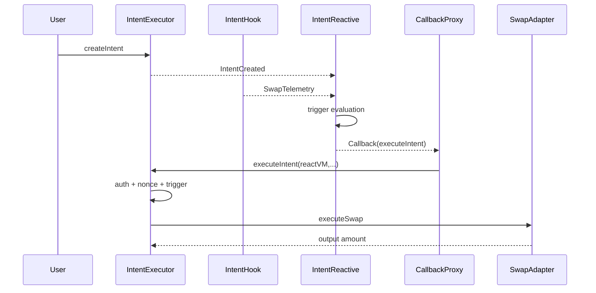
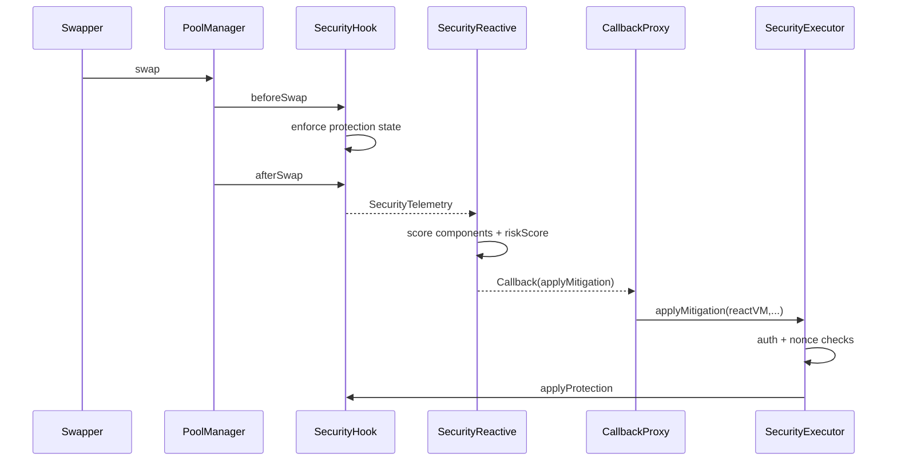
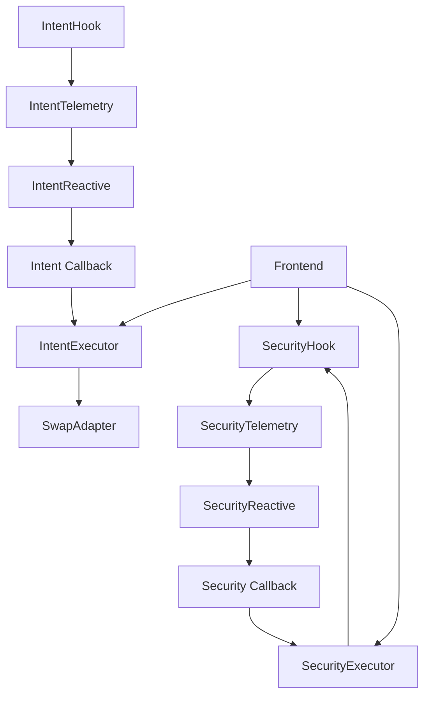

# Architecture

## Origin -> Reactive -> Destination

```mermaid
flowchart LR
  subgraph O[Origin Chain]
    PM[PoolManager]
    IH[IntentHook]
    SH[SecurityHook]
    PM --> IH
    PM --> SH
  end

  subgraph R[Reactive Network]
    SYS[System subscribe(...)]
    IR[IntentReactive]
    SR[SecurityReactive]
    SYS --> IR
    SYS --> SR
  end

  subgraph D[Destination Chain]
    CP[Callback Proxy]
    IE[IntentExecutor]
    SE[SecurityExecutor]
    AD[HookmateV4SwapAdapter]
    CP --> IE
    CP --> SE
    IE --> AD
    SE --> SH
  end

  IH -- SwapTelemetry --> IR
  SH -- SecurityTelemetry --> SR
  IR -- executeIntent callback --> CP
  SR -- applyMitigation callback --> CP
```

## Intent Lifecycle



## Security Lifecycle



## Component Interaction



## Contract Boundaries
- `IntentHook`: swap-observation telemetry source for intent triggers
- `IntentReactive`: trigger evaluation + callback dispatch
- `IntentExecutor`: callback auth + intent lifecycle + settlement
- `HookmateV4SwapAdapter`: swap execution adapter boundary
- `SecurityHook`: risk telemetry + mitigation enforcement
- `SecurityReactive`: deterministic risk scoring + callback dispatch
- `SecurityExecutor`: callback trust gate + replay/idempotency controls

## Reactive Dual-State Notes
Per Reactive base architecture:

- `rnOnly` code runs in Reactive Network state context
- `vmOnly` code runs in ReactVM context

`IntentReactive.react(LogRecord)` and `SecurityReactive.react(LogRecord)` are `vmOnly` entrypoints.
