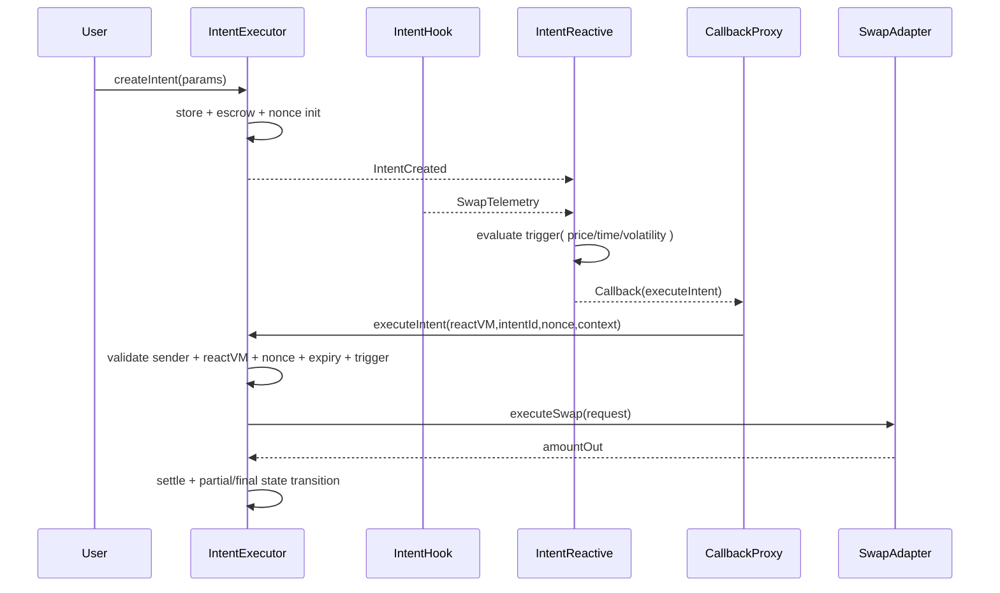
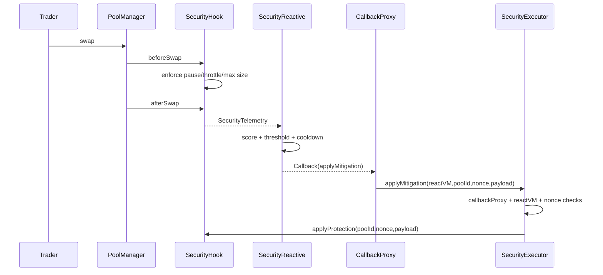
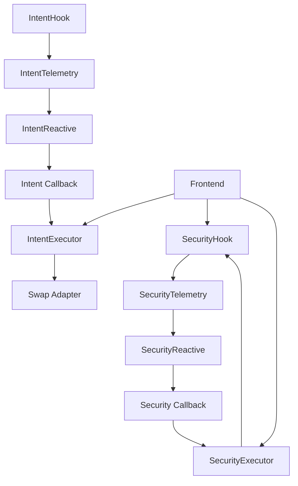

# RITE Specification

## 1. Scope
RITE (Reactive Intent Trading Engine + Hook Security Layer) is a deterministic, onchain-first execution and protection stack for Uniswap v4.

It combines two coordinated domains:
- Intent Automation Layer
- Hook Security Firewall Layer

Execution topology:
- Origin: Uniswap v4 hooks emit telemetry
- Reactive: react(LogRecord) computes deterministic decisions
- Destination: executors validate callback authenticity and apply idempotent actions

Source-of-truth references:
- `context/reactive/**`
- `context/uniswap_docs/**`

## 2. Goals
- deterministic trigger and risk decisions
- replay-safe callback execution
- idempotent stale callback handling
- gas-conscious scoring and state updates
- reproducible dependency pinning and CI verification

## 3. Non-Goals
- no claim of attack-proof behavior
- no mandatory offchain ML in critical mitigation path
- no trustless guarantees outside declared trust boundaries (callback infra, chain liveness)

## 4. Architecture

### 4.1 System Architecture
```mermaid
flowchart LR
  subgraph O[Origin Chain]
    PM[PoolManager]
    IH[IntentHook]
    SH[SecurityHook]
    PM --> IH
    PM --> SH
  end

  subgraph R[Reactive Network]
    SYS[System subscribe(...)]
    IR[IntentReactive]
    SR[SecurityReactive]
    SYS --> IR
    SYS --> SR
  end

  subgraph D[Destination Chain]
    CP[Callback Proxy]
    IE[IntentExecutor]
    SE[SecurityExecutor]
    AD[HookmateV4SwapAdapter]
    CP --> IE
    CP --> SE
    IE --> AD
    SE --> SH
  end

  IH -- Intent/Swap telemetry --> IR
  SH -- SecurityTelemetry --> SR
  IR -- executeIntent callback --> CP
  SR -- applyMitigation callback --> CP
```

### 4.2 Intent Lifecycle Sequence


### 4.3 Security Lifecycle Sequence


### 4.4 Component Interaction


## 5. Contract Responsibilities

### 5.1 IntentHook (Origin)
- implements `beforeSwap` and `afterSwap`
- emits deterministic telemetry (`SwapTelemetry`) for trigger evaluation
- tracks rolling volatility and pool-local observations

### 5.2 IntentReactive (Reactive)
- subscribes to intent + swap telemetry events
- tracks active intents and per-intent dispatch state
- performs deterministic trigger checks
- emits callback payload for `executeIntent(address,bytes32,uint256,bytes)`

### 5.3 IntentExecutor (Destination)
- validates callback sender (`callbackProxy`) and ReactVM allowlist
- enforces nonce matching and stale callback rejection
- validates execution context, trigger satisfaction, and expiry
- executes swaps via adapter and settles user funds
- handles partial fills, completion, cancellation, and refund paths

### 5.4 HookmateV4SwapAdapter
- custody-safe adapter boundary for Uniswap interaction
- isolates execution details from intent state machine
- deterministic return paths for output amount

### 5.5 SecurityHook (Origin)
- emits post-swap telemetry for risk scoring
- enforces active protection states in `beforeSwap`
- applies bounded mitigation payloads from authorized `securityExecutor`

### 5.6 SecurityReactive (Reactive)
- consumes `SecurityTelemetry`
- computes deterministic weighted risk score
- applies cooldown/dedup/nonce progression
- emits mitigation callback payloads to `SecurityExecutor`

### 5.7 SecurityExecutor (Destination)
- authenticates callback proxy and ReactVM identity
- enforces nonce monotonicity per pool
- applies mitigation to hook idempotently
- emits acceptance/rejection events

## 6. Uniswap v4 Conformance
- hook permissions encoded in hook address bits
- hook entrypoints are PoolManager-driven callbacks
- swap hooks implemented (`beforeSwap`/`afterSwap`)
- `PoolKey -> PoolId` usage is canonical
- no undocumented v4 APIs

## 7. Reactive Conformance
- subscriptions via system `subscribe(...)`
- `react(LogRecord)` processing with log deduplication
- callback payload arg0 placeholder overwritten by ReactVM ID
- destination executors validate callback proxy + ReactVM allowlist
- dual-state RN/VM behavior documented and preserved

## 8. Intent Engine Model

### 8.1 Intent State Machine
States:
- `NONE -> PENDING -> EXECUTED`
- `PENDING -> CANCELLED`
- `PENDING -> EXPIRED`

Allowed transitions are monotonic and terminal after final state.

### 8.2 Trigger Families
Let `ctx` be callback execution context.

Price trigger:
- if `priceAbove`: executable iff `ctx.observedSqrtPriceX96 >= target`
- else executable iff `ctx.observedSqrtPriceX96 <= target`

Time trigger:
- executable iff `observedAt >= startTime`
- and (`endTime == 0` or `observedAt <= endTime`)
- and interval constraints satisfied

Volatility trigger:
- if `volatilityAbove`: executable iff `ctx.observedVolatilityBps >= threshold`
- else executable iff `ctx.observedVolatilityBps <= threshold`

### 8.3 Partial Fill Sizing
For intent amount `A`, remaining `R`, and chunk bips `c`:
- proposed chunk `p = floor(R * c / 10000)`
- execution amount `e = clamp(p, 1, R)` unless context max amount is tighter

### 8.4 Slippage Constraint
For slice input `e` and full-intent minimum out `M` on total amount `A`:
- `sliceMinOut = max(1, floor(M * e / A))`
- execution valid iff `actualOut >= sliceMinOut`

### 8.5 Nonce + Replay Rules
- callback nonce must equal current intent nonce
- success increments nonce
- stale/future nonce is rejected deterministically without state corruption

## 9. Security Risk Model
All components are in BPS and deterministic.

Weights:
- volatility: 2000
- price deviation: 2000
- slippage: 1800
- imbalance: 1400
- volume spike: 1600
- temporal: 900
- mev heuristic: 700

Total cap = 10000.

Component ramp function for metric `x`, threshold `t`, weight `w`:
- if `t==0` or `x==0`: `0`
- if `x<=t`: `(x*w)/(2t)`
- if `x>=2t`: `w`
- else: `(w/2)+((x-t)*w)/(2t)`

Volume spike:
- if `lastVolume > 0` and `v > lastVolume`:
- `volumeSpikeBps = ((v-lastVolume)*10000)/lastVolume`

Temporal correlation:
- activated when event spacing <= temporal window and deviation/slippage elevated

MEV heuristic:
- activated on short-window direction flip with elevated slippage + imbalance

Final score:
- `riskScore = min(10000, sum(components))`

## 10. Mitigation Policy
High risk:
- adaptive fee by default
- may escalate to combined mode on MEV-sensitive signal

Critical risk:
- combined mitigation (fee + throttle + pause)

Protection bounds (enforced by hook config):
- fee <= maxFeePips
- throttle <= maxThrottleBps
- pauseSeconds <= maxPauseSeconds

## 11. Security Controls
Implemented controls:
- callback authenticity (`msg.sender == callbackProxy`)
- ReactVM identity allowlist
- replay protection via nonce monotonicity
- idempotent stale handling
- reentrancy guards on external callback execution paths
- strict config/input bounds validation
- deterministic arithmetic and bounded outputs

## 12. Threat Model
In-scope:
- forged callback sender
- forged ReactVM identity
- replay/stale payload delivery
- toxic flow bursts and manipulation attempts
- flash-loan-like volume shocks
- intent replay and stale execution contexts

Out-of-scope dependencies:
- callback proxy liveness/correctness
- reactive network liveness
- chain-level censorship/finality anomalies

Residual risks:
- false positive/negative calibration risk in extreme regimes
- adversarial flow shaping below threshold bands
- operator misconfiguration risk

## 13. Test and Assurance Requirements
- unit tests for each contract and library
- integration tests for Origin -> Reactive -> Destination lifecycle
- fuzz tests for trigger/risk boundary behavior
- invariant tests for nonce monotonicity and state transition safety
- security tests for callback auth, replay, stale no-op paths
- economic correctness tests for slippage, partial fills, and bound enforcement

Coverage goal:
- 100% line/branch for project contracts (enforced in CI)

## 14. Reproducibility Requirements
Pinned dependencies:
- v4-periphery: `3779387e5d296f39df543d23524b050f89a62917`
- v4-core: `59d3ecf53afa9264a16bba0e38f4c5d2231f80bc`

Required verification surfaces:
- `scripts/bootstrap.sh`
- `scripts/verify_uniswap_pin.sh`
- `.github/workflows/ci.yml`

## 15. Assumptions / TBD
- callback proxy addresses are per-network operational parameters
- ReactVM allowlist is managed by trusted owner/multisig
- production threshold tuning is pool-class dependent
- additional adversarial simulations are required before large-scale mainnet rollout
- intent and security dashboards should converge into one operator pane with alerting
